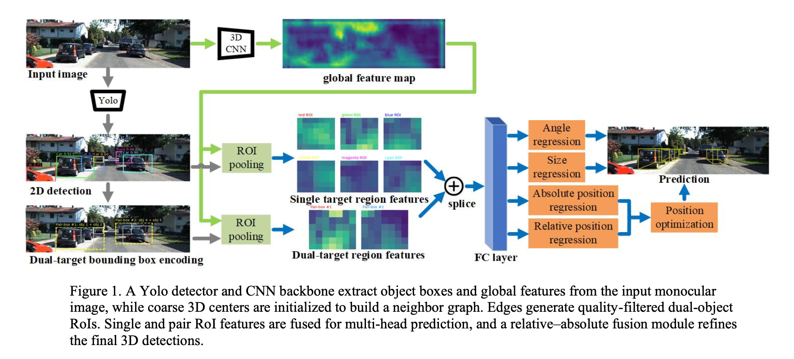

# DT-BBox 3D Detection



3D object detection with DT-BBox (Dual Target Bounding Box) approach.

## Project Structure

```
DTBBox_3D_Detection/
│
├── configs/              # Configuration files
│   └── kitti.yaml
│
├── data/                 # Dataset
│   └── kitti/            # KITTI dataset
│       ├── training/     # Training data
│       │   ├── image_2/  # Images
│       │   ├── label_2/  # Labels
│       │   └── calib/    # Calibration files
│       └── ImageSets/    # Split files
│           ├── train.txt
│           └── val.txt
│
├── datasets/             # Dataset loaders
│   ├── __init__.py
│   └── kitti_dataset.py
│
├── models/               # Model definitions
│   ├── __init__.py
│   ├── backbone.py
│   └── dtbbox_net.py
│
├── modules/              # Network modules
│   ├── __init__.py
│   ├── pair_graph.py
│   ├── roi_utils.py
│   └── rpfo.py
│
├── utils/                # Utility functions
│   ├── __init__.py
│   ├── box_ops.py
│   ├── geometry.py
│   ├── losses.py
│   ├── metrics.py
│   ├── misc.py
│   └── visualize.py
│
├── checkpoints/          # Model checkpoints
├── outputs/              # Output results
│
├── train.py              # Training script
├── eval.py               # Evaluation script
├── demo.py               # Demo script
├── requirements.txt      # Dependencies
└── README.md             # This file
```

## Setup

1. **Install dependencies**:
   ```bash
   pip install -r requirements.txt
   ```

2. **Prepare KITTI dataset**:
   - Download KITTI 3D object detection dataset from [official website](http://www.cvlibs.net/datasets/kitti/eval_object.php?obj_benchmark=3d)
   - Required files:
     - `data_object_image_2.zip` (left color images)
     - `data_object_label_2.zip` (label files)
     - `data_object_calib.zip` (calibration files)
   - Extract all files to `data/kitti/training/` directory
   - Generate split files:
     ```bash
     python3 - <<'PY'
     import os
     import random

     img_dir = "data/kitti/training/image_2"
     ids = sorted([
         os.path.splitext(x)[0]
         for x in os.listdir(img_dir)
         if x.endswith(".png")
     ])

     if len(ids) == 0:
         raise RuntimeError("image_2 里面没有图片，请先放入 KITTI 数据")

     random.seed(42)
     random.shuffle(ids)

     n_train = int(len(ids) * 0.8)

     os.makedirs("data/kitti/ImageSets", exist_ok=True)

     with open("data/kitti/ImageSets/train.txt", "w") as f:
         for x in ids[:n_train]:
             f.write(x + "\n")

     with open("data/kitti/ImageSets/val.txt", "w") as f:
         for x in ids[n_train:]:
             f.write(x + "\n")

     print("total:", len(ids))
     print("train:", n_train)
     print("val:", len(ids) - n_train)
     PY
     ```

## Training

### Command-line arguments
- `--config`: Path to configuration file (default: configs/kitti.yaml)
- `--stage`: Training stage (baseline, dtbbox, relative, full)
- `--resume`: Path to checkpoint to resume training
- `--epochs`: Number of training epochs (overrides config)
- `--batch_size`: Batch size (overrides config)

### Examples
```bash
# Train baseline model for 1 epoch with batch size 1
python3 train.py --stage baseline --epochs 1 --batch_size 1

# Train dtbbox model
python3 train.py --stage dtbbox

# Train relative model
python3 train.py --stage relative

# Train full model
python3 train.py --stage full
```

## Evaluation

```bash
python3 eval.py --stage baseline --checkpoint checkpoints/checkpoint_epoch_100.pth
```

## Demo

```bash
python3 demo.py --stage full --checkpoint checkpoints/checkpoint_epoch_100.pth --sample_id 000001
```

## Stages

- **baseline**: Single target RoI
- **dtbbox**: Dual target RoI
- **relative**: Dual target RoI + Relative head
- **full**: Dual target RoI + Relative head + R-PFO (test time)

## Notes

- The R-PFO module is only used during inference (not training)
- The model uses ResNet18 as backbone by default
- Training with larger batch sizes and more epochs is recommended for better performance

## Troubleshooting

- **Error loading image**: Make sure KITTI dataset is properly placed in `data/kitti/training/`
- **Pickle error**: The code uses a serializable collate function for multiprocessing
- **CUDA out of memory**: Reduce batch size or use a smaller backbone
